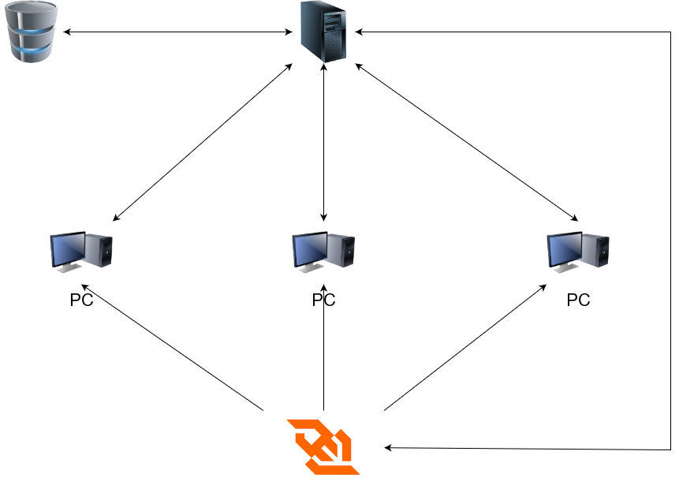

# Message Delivery

Este projeto tem como objetivo implementar um sistema de envio de mensagens entre múltiplos usuários.

## Arquitetura

 

## Componentes e Funcionalidades:

Usuário:
    
- Autentica-se no sistema através da interface de usuário.
- Submete uma solicitação para enviar um e-mail, fornecendo os destinatários, o conteúdo e outras informações necessárias.
- Criar grupos de pessoas para envio de mensagens.

Servidor:
- Valida as credenciais do usuário.
- Processa as solicitações do usuário.

Banco de Dados:
- Armazena informações relevantes, como dados do usuário, configurações de e-mail e histórico de envio de e-mails.
- Escalável e tolerante a falhas.

WebSocket:
- Fornece uma comunicação em tempo real para atualização dos e-mails enviados e recebidos.

## Tecnologias Utilizadas:

- React
- Node.js
- Express
- MongoDB
- WebSocket

## Fluxo de Envio de E-mails:

1. O usuário se autentica no sistema.
2. O usuário submete uma solicitação para enviar um e-mail.
3. O servidor recebe a solicitação de envio de e-mail do usuário.
4. O servidor trato a solicitação a partir das informações do usuário.
5. WebSocket atualiza a interface do usuário com as informações do e-mail enviado.

## Alunos

<table style="display: flex; align-items: center;  flex-direction: row; gap: 10px;" ><tr>

<td><a href="https://github.com/marcosquadross/">
 
 
 <b>Marcos Quadros
</b>
 </a> 

RA: 2380560</td>

<td><a href="https://github.com/thiagogquinto">
 
 
 <b>Thiago Gariani
</b>
 </a> 

RA: 2388898</td>

</tr></table>