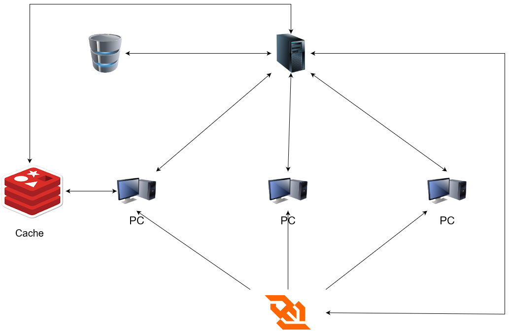

# Message Delivery

Este projeto tem como objetivo implementar um sistema de envio de mensagens em tempo real entre múltiplos usuários.

## Arquitetura


<br>

## Componentes e Funcionalidades:

Usuário:
- Autentica-se no sistema através da interface de usuário.
- Submete uma solicitação para enviar um e-mail, fornecendo os destinatários, o conteúdo e outras informações necessárias.
- Criar grupos de pessoas para envio de mensagens.

Servidor:
- Valida as credenciais do usuário.
- Processa as solicitações do usuário.

Banco de Dados:
- Armazena informações relevantes, como dados do usuário, configurações de e-mail e histórico de envio de e-mails.
- Escalável

WebSocket:
- Fornece uma comunicação em tempo real para atualização dos e-mails enviados e recebidos.

Redis:
- Armazena as mensagens enviadas e recebidas.
- Escalável, consistente e suporta concorrência.

## Tecnologias:

- [React](https://react.dev/)
- [Node.js](https://nodejs.org/en/)
- [MongoDB](https://www.mongodb.com/pt-br)
- [WebSocket](https://www.npmjs.com/package/ws)
- [Redis](https://redis.io/)

## Fluxo de Utilização:

1. O usuário se autentica no sistema.
**(OPCIONAL)** 1.1. O usuário cria um grupo de pessoas para envio de mensagens.
2. O usuário submete uma solicitação para enviar um e-mail.
3. O servidor recebe a solicitação de envio de e-mail do usuário.
4. O servidor trata a solicitação a partir das informações recebidas.
5. WebSocket atualiza a interface do usuário em tempo real com as informações do e-mail enviado.
6. Interface do usuário exibe as informações do e-mail enviado.


## Interface de Serviço:

### Usuário:

#### Cadastro:
- **URL:** `/api/user/register`
    - **Método:** `GET`
    - **Corpo:**
        ```json
        {
            "name": "string",
            "username": "string",
            "password": "string",
            "telephone": "string"
        }
        ```

#### Autenticação:
- **URL:** `/api/user/login`
    - **Método:** `POST`
    - **Corpo:**
        ```json
        {
            "username": "string",
            "password": "string"
        }
        ```

### Mensagem:

#### Enviar Mensagem:
- **URL:** `/api/message`
    - **Método:** `POST`
    - **Corpo:**
        ```json
        {
            "author": "string",
            "recipients": ["string"],
            "title": "string",
            "content": "string",
            "time": new Date()
        }
        ```

#### Visualizar Mensagens Enviadas:
- **URL:** `/api/message/author/author_id`
    - **Método:** `GET`

#### Visualizar Mensagens Recebidas:
- **URL:** `/api/message/recipient/recipient_id`
    - **Método:** `GET`

### Grupo:

#### Criar Grupo:
- **URL:** `/api/group`
    - **Método:** `POST`
    - **Corpo:**
        ```json
        {
            "name": "string",
            "members": ["string"]
        }
        ```

#### Visualizar Grupos:
**URL:** `/api/groups/user/user_id`
    - **Método:** `GET`

## Interface de Usuário:
- Tela de Login
- Tela de Cadastro
- Tela de Visualização de Mensagens Enviadas
- Tela de Visualização de Mensagens Recebidas
- Modal de Envio de Mensagem
- Modal de Criação de Grupo
- Dropdown de visualização de grupos


## Alunos

<table style="display: flex; align-items: center;  flex-direction: row; gap: 10px;" ><tr>

<td><a href="https://github.com/marcosquadross/">
 
<br />
 <b>Marcos Quadros
</b>
 </a> <a href="https://github.com/marcosquadross/" title="Repositório Marcos Quadros"></a>

RA: 2380560</td>


<td><a href="https://github.com/thiagogquinto">
 
<br />
 <b>Thiago Gariani
</b>
 </a> <a href="https://github.com/thiagogquinto" title="Repositório Thiago Gariani"></a>

RA: 2388898</td>

</tr></table>